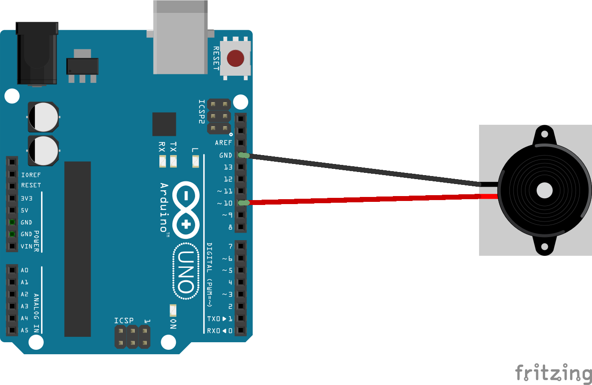
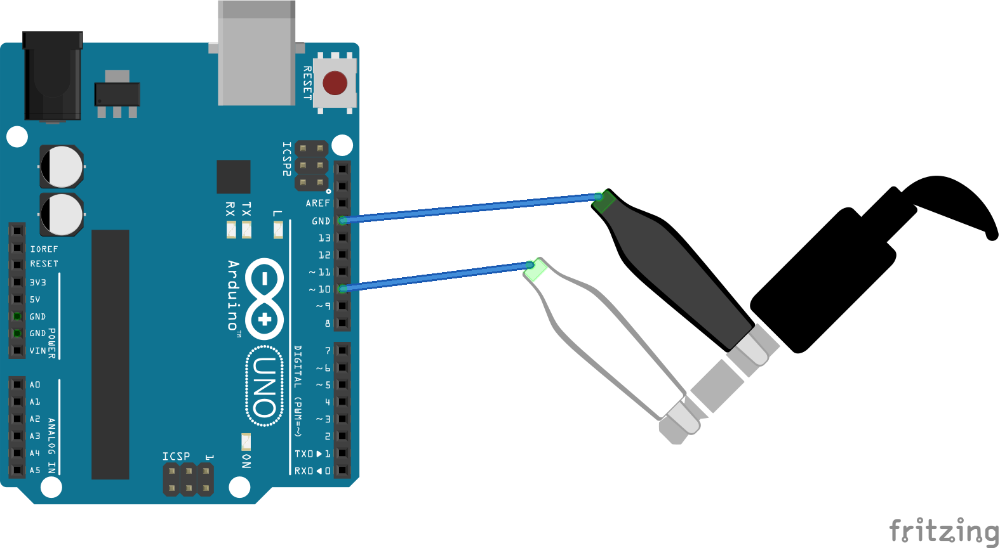

# Jingle Bells Arduino

```
     ___
   _|---|_
    ('>')___/
>--(`^'^')
  (`^'^'^`)
  `======='
```

Tis the season, so here are a couple of ways to play James Lord Pierpont's classic on an Arduino

## Sketches

### Jingle Bells

A simple, brute force way of playing through some notes. All notes of `verse[]` and `chorus[]` are stored in separate arrays. We then loop over these referencing the respective `verseRhythm[]` and `chorusRhythm[]` arrays.

The melody arrays end with a `-1`, which is a cute way of figuring out when to stop when you don't necessarily know the length of a static array.

```cpp
for (int i = 0; verse[i] != -1; i++)
```

## Wiring

In the current sketch, the output is always on `pin 10`, though this can be changed.

You can use either a piezo buzzer



Or clip straight to your headphones with jumper wire and crocodile clips.




In either case make sure you are using `pin 10`, or whichever pin you have dictated to use.
